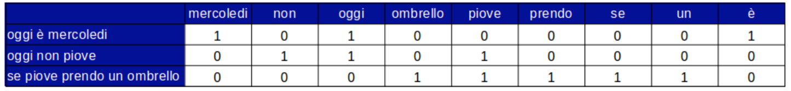
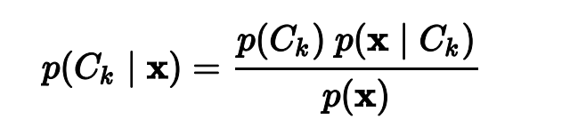

## Text Mining

> __E' un applicazione del Machine Learning__

> *Processo di estrazione di informazione dai testi*

> Non fa distinzioni dal tipo di lingua utilizzata

slide -> slide/Text mainin.pdf

#### Dove lo possiamo trovare...

* Social Network
* Siti E-commerce ( recensione)
* Ovunque siano presenti testi non strutturati ( Linguaggio Naturale e' un dato non strutturato )

#### Scopi
* __Text categorization__ ( Categorizzazione di Testi per esempio: sport, politica, ecc...)
* __Text clustering__ ( Raggruppamento per i dati divisi per argomento richiesto ) 
* __Estrazione di concetti e di entità__ (prendere un testo, dato non strutturato e trasformarlo in dati strutturati )
* __Individuazione di relazioni fra entità__ 
* __Individuazione di tassonomie__( In Scienze naturali: studio della teoria e delle regole di classificazione.
In questo contesto indica la ricerca di elementi caratteristici dei vari contenuti )

* __Sentiment analysis__ ( capire il sentimento prevalente di chi sta leggendo o della cumunita' : arrabbiata, triste, felice)
  * Questa funzionalita' viene usata ovunque ultimamente

### Information Extraction

* recupero informazioni strutturate da documenti non
strutturati

#### Problema

* I documenti sono espressi in linguaggio naturale
* Sintassi non strutturate


#### Soluzione...

1. Abbiamo un testo in linguaggio naturale da analizzare
2. Vogliamo capire se parla di un argomento o di un altro
3. Problema di __classificazione__
   * Di cosa parla ??
   * C'è un sentimento espresso ??
      * è positivo o negativo ?
   *  Eientra nelle categorie di interesse ?


### Problemi...
* __Classificazione__
* Costruzione di __dataset__ 
* __Labeling__ della instanza ( fatta da una persona )
* __Scelta di algoritmo__ adeguato
* __Addestramento__ del classificatore
* __Valutazione__ delle prestazioni

## esempio Labeling ( categoria: stagioni )

```python 

Oggi c'è un bel sole, è caldo, si sta bene al mare : ESTATE
Ho voglia di acqua e di mare : ESTATE
Che freddo con questa neve! si sta bene sotto le coperte : INVERNO
Le previsioni danno ghiaccio è neve : INVERNO
Mi piace la vendemmia... Il marrone delle foglie... : AUTUNNO
Le foglie stanno cadendo tutte... è proprio autunno : AUTUNNO
In questa stagione è bello camminare anche sotto le stelle : PRIMAVERA
Domenica, se fa caldo, faremo un bel picnic in mezzo ai fiori : PRIMAVERA

```
## Librerie Python

__Pandas__  [link](htpps://pandas.pydata.org/)
* E' una libreria software scritta per Python per la manipolazione e l'analisi dei dati. In particolare, offre strutture dati e operazioni per la manipolazione di tabelle numeriche e serie temporali.


__numpy__   [link](https://numpy.org/)
* E' una libreria per Python, che aggiunge il supporto per grandi array e matrici multidimensionali, insieme ad una vasta collezione di funzioni matematiche di alto livello per operare su questi array.


## Esempio

DATASET, FILE DI TESTO( 'DATASET.CSV') [Dataset example](https://www.kaggle.com/datasets)

```python 
text,class
"oggi c'è un bel sole, è caldo, si sta bene al mare", ESTATE
"Ho voglia di acqua e di mare", ESTATE
"Che freddo con questa neve! si sta bene sotto le coperte", INVERNO
"Le previsioni danno ghiaccio è neve", INVERNO
"Mi piace la vendemmia... Il marrone delle foglie...", AUTUNNO
"Le foglie stanno cadendo tutte... è proprio autunno", AUTUNNO
"Domenica, se fa caldo, faremo un bel picnic in mezzo ai fiori", PRIMAVERA
"In questa stagione è bello camminare anche sotto le stelle ", PRIMAVERA
```
CODE PYTHON

```python 

import pandas as pd
import numpy as np
from io import StringIO
data = pd.read_csv("dataset.csv", ",")
print(data)

```

OUTPUT 

```python 
text                                                class
0 oggi c'è un bel sole, è caldo, si sta bene al ... ESTATE
1 Ho voglia di acqua e di mare ESTATE
2 Che freddo con questa neve! si sta bene sotto ... INVERNO
3 Le previsioni danno ghiaccio è neve INVERNO
4 Mi piace la vendemmia... Il marrone delle fogl... AUTUNNO
5 Le foglie stanno cadendo tutte... è proprio au... AUTUNNO
6 Domenica, se fa caldo, faremo un bel picnic in... PRIMAVERA
7 In questa stagione è bello camminare anche sot... PRIMAVERA
```

### Vettorizazzione

* Gli algoritmi lavorano con features numeriche (intere o float)
* Le istanze del dataset sono stringhe

Soluzione:
__Vettorizzazione e Tokenizzazione__
*  __Tokenizzazione__ Significa che ogni stringa viene rappresentato come vettore di parole ( splittato rispetto allo spazio )( e' un passaggio fondamentale )
   * ogni stringa è rappresentata come insieme di __token__ (parole)
* __Vettorizzazione__ 
  * Sia __S__ l'insieme __senza ripetizioni__ di tutti i token del dataset
  * Ogni elemento __si ∈ S__ rappresenti una dimensione di un vettore di
booleani
    *Ogni istanza del dataset è rappresentata con un vettore di booleani
(1 se il token è presente, 0 altrimenti)

* Una volta che ho l'inseme di parole (bag di parole) prendo tutte le parole una volta sola di tutto il dataset e costruisco un __vettore di boolean__ e metto
0 se la parola e' presente nella frase altrimenti 1 se e' presente nella

#### Esempio Vettorizzazione 

* sia dataset D = {"oggi è mercoledi", "oggi non piove", "se piove prendo un
ombrello"}
* sia S = ['mercoledi', 'non', 'oggi', 'ombrello', 'piove', 'prendo', 'se', 'un', 'è']



In questo modo ho una raprresentazione numerica della frase su cui posso applicare tutti gli algoritmi necessari (separazione, ecc...)

Per il programma le parole ovviamente non hanno senso ma riesce a classificarle numericamenre, tutto quello che e' fuori dalle frasi per il programma non esiste

CODE PYTHON

```python 
# libreria sklearn per tokenization e vectorization
from sklearn.feature_extraction.text import CountVectorizer
# separiamo features dalle classi
X = data["text"] # in questo momento abbiamo ancora una sola feature
print(X)
```
OUTPUT

```python 
0 Oggi c'è un bel sole, è caldo, si sta bene al ...
1 Ho voglia di acqua e di mare
2 Che freddo con questa neve! si sta bene sotto ...
3 Le previsioni danno ghiaccio è neve
4 Mi piace la vendemmia... Il marrone delle fogl...
5 Le foglie stanno cadendo tutte... è proprio au...
6 Domenica, se fa caldo, faremo un bel picnic in...
7 In questa stagione è bello camminare anche sot...
Name: text, dtype: object
```

CODE PYTHON 

```python 
# istruzioni per trasformare X in rappresentazione array
vectorizer_train = CountVectorizer(min_df=0)
vectorizer_train.fit(X)
# min_df=0 significa "considerare tutti i token, anche se compaiono una sola volta"
tokens = vectorizer_train.get_feature_names()
print(tokens)
```

OUTPUT

```python 

['acqua', 'ai', 'al', 'anche', 'autunno', 'bel', 'bello', 'bene', 'cadendo',
'caldo', 'camminare', 'che', 'con', 'coperte', 'danno', 'delle', 'di', 'domenica',
'fa', 'faremo', 'fiori', 'foglie', 'freddo', 'ghiaccio', 'ho', 'il', 'in', 'la', 'le',
'mare', 'marrone', 'mezzo', 'mi', 'neve', 'oggi', 'piace', 'picnic', 'previsioni',
'proprio', 'questa', 'se', 'si', 'sole', 'sotto', 'sta', 'stagione', 'stanno',
'stelle', 'tutte', 'un', 'vendemmia', 'voglia']

```
[Scikit learn link](https://scikit-learn.org/stable/modules/generated/sklearn.feature_extraction.text.CountVectorizer.html)


Ottengo la lista di tutti* i tokens presenti nel dataset D ( i token di dimensione 1 vengono esclusi per default perché poco significativi)


Rappresentazione della prima istanza
"Oggi c'è un bel sole, è caldo, si sta bene al mare"

### ARRAY RAPRESENTATION
```python
[0, 0, 1, 0, 0, 1, 0, 1, 0, 1, 0, 0, 0, 0, 0, 0, 0, 0, 0, 0, 0, 0,
0, 0, 0, 0, 0, 0, 0, 1, 0, 0, 0, 0, 1, 0, 0, 0, 0, 0, 0, 1, 1, 0,
1, 0, 0, 0, 0, 1, 0, 0]
```

Adesso è possibile addestrare un classificatore poiche' siamo passati ad uno
spazio numerico

```python

vectorizer_train = CountVectorizer(min_df=0)
vectorizer_train.fit(X)
x_train_array = vectorizer_train.transform(X).toarray()

```

* Text analysis : in letteratura algoritmo Bayesiano
* probabilità che una certa parola P sia presente in un certo documento D data
alla classe C




> Il sistema non lavora su String ma su un matrice di booleani ( composta da 0 e 1) che rapresnta il rapporto tra frase e il dataset preso in esame

CODE PYTHON 

```python 
from sklearn.naive_bayes import MultinomialNB
clf = MultinomialNB().fit(x_train_array, y)
# classifichiamo una nuova frase
msg = "adoro giocare con l'acqua e la sabbia sotto il sole caldo"
# trasformiamo in array sulla base della **medesima vettorizzazione**
msg_array = vectorizer_train.transform([msg]).toarray()
print(msg_array)
```
OUTPUT 

```python 
[1, 0, 0, 0, 0, 0, 0, 0, 0, 1, 0, 0, 1, 0, 0, 0, 0, 0, 0, 0, 0, 0,
0, 0, 0, 1, 0, 1, 0, 0, 0, 0, 0, 0, 0, 0, 0, 0, 0, 0, 0, 0, 1, 1,
0, 0, 0, 0, 0, 0, 0, 0]
```

> Per cui per __catalogare__: trasformo un'atra frase con lo stesso dataset iniziale in un array con la stessa dimensione del dataset

>La frase da 11 token 4 non sono presenti nel dataset iniziale e per cui vengono cancellati

abbiamo trasformato una istanza di tipo testo nello spazio vettoriale booleano
generato dall'operazione di tokenizzazione riferita al dataset inziale

```python 

# il msg è "adoro giocare con l'acqua e la sabbia sotto il sole caldo"
class_probabilities = clf.predict_proba(msg_array)[0]
print(list(zip(ordered_class_list, class_probabilities)))

```

OUTPUT 

```python 
#confidance che sia 23,5% autunno, 42,4% estate ecc...
[(' AUTUNNO', 0.23512362166747044), 
(' ESTATE', 0.42392349623391468),
(' INVERNO', 0.21196174811695767),
(' PRIMAVERA', 0.12899113398165785)]
```

```python
print(clf.predict(msg_array)) 
```
OUTPUT 
```python 
[' ESTATE'] 
```
Ricorda: Per il sistema questa operazione non ha valore semantico 

### ESERCIZIO per imparare 
__Finding the frequency distinct in the tokens__

```python 

import pandas as pd
import numpy as np
from io import StringIO

msg = "Oggi ho fatto un corso per imparare a fare cose e sono felice"

```
